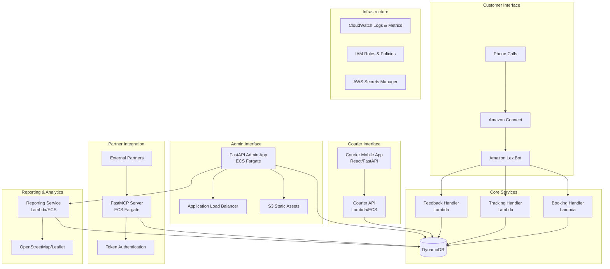

# Design Document

## Overview

The Amazon Connect Courier Bot is a comprehensive voice-enabled courier service platform that integrates multiple AWS services to provide end-to-end courier management capabilities. The system consists of a voice interface through Amazon Connect and Lex, a FastAPI-based admin application, a courier mobile interface, partner integration via FastMCP, and comprehensive reporting with interactive mapping.

The architecture follows a hybrid approach using both serverless (Lambda) and containerized (ECS Fargate) components to optimize for performance, cost, and scalability. The system supports flexible deployment options including local development with Docker Compose and cloud deployment via CloudFormation.

## Architecture

### High-Level Architecture



### Component Architecture

The system is organized into the following major components:

1. **Voice Interface Layer** - Amazon Connect + Lex for customer interactions
2. **Admin Management Layer** - FastAPI application for system administration
3. **Courier Interface Layer** - Mobile-optimized web interface for couriers
4. **Partner Integration Layer** - FastMCP server for external partner access
5. **Data Layer** - DynamoDB with optimized table design
6. **Reporting Layer** - Analytics and visualization services
7. **Infrastructure Layer** - AWS services and deployment automation

## Components and Interfaces

### 1. Voice Interface Components

#### Amazon Lex Bot Configuration
- **Bot Name**: CourierServiceBot
- **Intents**:
  - `BookCourier` - Handle courier booking requests
  - `TrackDelivery` - Provide delivery status updates
  - `SubmitFeedback` - Collect customer feedback and complaints
  - `GetHelp` - Provide general assistance

#### Intent Slot Definitions
```json
{
  "BookCourier": {
    "slots": {
      "PickupAddress": "AMAZON.StreetAddress",
      "DeliveryAddress": "AMAZON.StreetAddress", 
      "PackageSize": "PackageSizeType",
      "PackageWeight": "AMAZON.NUMBER",
      "PickupTime": "AMAZON.TIME",
      "SpecialInstructions": "AMAZON.AlphaNumeric"
    }
  },
  "TrackDelivery": {
    "slots": {
      "BookingReference": "BookingReferenceType"
    }
  },
  "SubmitFeedback": {
    "slots": {
      "BookingReference": "BookingReferenceType",
      "FeedbackType": "FeedbackTypeEnum",
      "Rating": "AMAZON.NUMBER",
      "Comments": "AMAZON.AlphaNumeric"
    }
  }
}
```

#### Lambda Intent Handlers
Each intent is backed by a dedicated Lambda function:

- **BookingHandler** (`booking_handler.py`)
  - Validates address information
  - Generates unique booking reference
  - Stores booking data in DynamoDB
  - Returns confirmation to customer

- **TrackingHandler** (`tracking_handler.py`)
  - Retrieves delivery status from DynamoDB
  - Provides location and ETA information
  - Handles invalid reference numbers

- **FeedbackHandler** (`feedback_handler.py`)
  - Stores customer feedback and complaints
  - Flags high-severity issues
  - Generates feedback reference numbers

### 2. FastAPI Admin Application

#### Application Structure
```
admin_app/
├── main.py                 # FastAPI application entry point
├── routers/
│   ├── deployment.py       # Deployment wizard endpoints
│   ├── dashboard.py        # System monitoring dashboard
│   ├── configuration.py    # Bot configuration management
│   └── reports.py          # Reporting and analytics
├── services/
│   ├── aws_service.py      # AWS resource management
│   ├── deployment_service.py # Infrastructure deployment
│   └── monitoring_service.py # System health monitoring
├── models/
│   ├── deployment.py       # Deployment configuration models
│   ├── dashboard.py        # Dashboard data models
│   └── reports.py          # Reporting data models
└── templates/
    ├── deployment_wizard.html
    ├── dashboard.html
    └── reports.html
```

#### Key API Endpoints
- `POST /api/deployment/start` - Initiate infrastructure deployment
- `GET /api/deployment/status` - Check deployment progress
- `GET /api/dashboard/metrics` - Retrieve system metrics
- `PUT /api/configuration/bot` - Update bot configuration
- `GET /api/reports/analytics` - Generate analytics reports

#### Deployment Wizard Flow
1. **Environment Configuration** - AWS credentials and region setup
2. **Resource Planning** - Select deployment options (Lambda vs ECS)
3. **Infrastructure Provisioning** - Create AWS resources via CloudFormation
4. **Bot Configuration** - Set up Lex bot and intents
5. **Connect Integration** - Associate bot with Amazon Connect
6. **Testing & Validation** - Verify system functionality

### 3. Courier Mobile Interface

#### Technology Stack
- **Frontend**: React with responsive design for mobile devices
- **Backend**: FastAPI with authentication middleware
- **Deployment**: Can be deployed as static files (S3) or containerized (ECS)

#### Core Features
- **Authentication**: JWT-based login system
- **Delivery Management**: List and update delivery status
- **Location Services**: GPS integration for location confirmation
- **Performance Analytics**: Personal delivery statistics
- **Route Optimization**: Suggested delivery sequences

#### API Endpoints
- `POST /api/courier/login` - Courier authentication
- `GET /api/courier/deliveries` - Get assigned deliveries
- `PUT /api/courier/delivery/{id}/status` - Update delivery status
- `GET /api/courier/analytics` - Personal performance metrics
- `GET /api/courier/route-optimization` - Optimized delivery routes

### 4. FastMCP Partner Integration

#### MCP Server Configuration
The FastMCP server provides secure API access for external partners:

```python
# MCP Server Tools
tools = [
    {
        "name": "book_courier",
        "description": "Book a courier delivery",
        "parameters": {
            "pickup_address": "string",
            "delivery_address": "string", 
            "package_details": "object",
            "pickup_time": "string"
        }
    },
    {
        "name": "track_delivery", 
        "description": "Track delivery status",
        "parameters": {
            "booking_reference": "string"
        }
    },
    {
        "name": "get_delivery_history",
        "description": "Get partner's delivery history", 
        "parameters": {
            "date_range": "object",
            "status_filter": "string"
        }
    }
]
```

#### Authentication & Security
- **Token-based Authentication**: JWT tokens with partner-specific scopes
- **Rate Limiting**: Configurable limits per partner
- **Data Isolation**: Partner-specific data access controls
- **Audit Logging**: Complete audit trail of partner interactions

### 5. Reporting and Analytics System

#### Interactive Mapping
- **Technology**: OpenStreetMap with Leaflet.js
- **Features**:
  - Real-time courier location tracking
  - Route visualization between pickup and delivery points
  - Global view with color-coded status indicators
  - Heat maps for delivery density analysis

#### Analytics Dashboard
- **Individual Courier Reports**: Detailed status and location tracking
- **Global Operations View**: World map with all active deliveries
- **Performance Metrics**: Success rates, delivery times, customer satisfaction
- **Trend Analysis**: Volume patterns, peak hours, route optimization

#### Export Capabilities
- **PDF Reports**: Executive summaries and detailed analytics
- **CSV Data Export**: Raw data for external analysis
- **Real-time Updates**: WebSocket connections for live dashboard updates

## Data Models

### DynamoDB Table Design

#### 1. Bookings Table
```json
{
  "TableName": "CourierBookings",
  "KeySchema": [
    {
      "AttributeName": "booking_id",
      "KeyType": "HASH"
    }
  ],
  "AttributeDefinitions": [
    {
      "AttributeName": "booking_id",
      "AttributeType": "S"
    },
    {
      "AttributeName": "customer_phone",
      "AttributeType": "S"
    },
    {
      "AttributeName": "status",
      "AttributeType": "S"
    },
    {
      "AttributeName": "created_date",
      "AttributeType": "S"
    }
  ],
  "GlobalSecondaryIndexes": [
    {
      "IndexName": "CustomerPhoneIndex",
      "KeySchema": [
        {
          "AttributeName": "customer_phone",
          "KeyType": "HASH"
        }
      ]
    },
    {
      "IndexName": "StatusDateIndex", 
      "KeySchema": [
        {
          "AttributeName": "status",
          "KeyType": "HASH"
        },
        {
          "AttributeName": "created_date",
          "KeyType": "RANGE"
        }
      ]
    }
  ]
}
```

#### 2. Tracking Table
```json
{
  "TableName": "DeliveryTracking",
  "KeySchema": [
    {
      "AttributeName": "booking_id",
      "KeyType": "HASH"
    },
    {
      "AttributeName": "timestamp",
      "KeyType": "RANGE"
    }
  ],
  "AttributeDefinitions": [
    {
      "AttributeName": "booking_id",
      "AttributeType": "S"
    },
    {
      "AttributeName": "timestamp",
      "AttributeType": "S"
    },
    {
      "AttributeName": "courier_id",
      "AttributeType": "S"
    }
  ],
  "GlobalSecondaryIndexes": [
    {
      "IndexName": "CourierIndex",
      "KeySchema": [
        {
          "AttributeName": "courier_id",
          "KeyType": "HASH"
        },
        {
          "AttributeName": "timestamp",
          "KeyType": "RANGE"
        }
      ]
    }
  ]
}
```

#### 3. Feedback Table
```json
{
  "TableName": "CustomerFeedback",
  "KeySchema": [
    {
      "AttributeName": "feedback_id",
      "KeyType": "HASH"
    }
  ],
  "AttributeDefinitions": [
    {
      "AttributeName": "feedback_id",
      "AttributeType": "S"
    },
    {
      "AttributeName": "booking_id",
      "AttributeType": "S"
    },
    {
      "AttributeName": "severity",
      "AttributeType": "S"
    }
  ],
  "GlobalSecondaryIndexes": [
    {
      "IndexName": "BookingIndex",
      "KeySchema": [
        {
          "AttributeName": "booking_id",
          "KeyType": "HASH"
        }
      ]
    },
    {
      "IndexName": "SeverityIndex",
      "KeySchema": [
        {
          "AttributeName": "severity",
          "KeyType": "HASH"
        }
      ]
    }
  ]
}
```

#### 4. Couriers Table
```json
{
  "TableName": "Couriers",
  "KeySchema": [
    {
      "AttributeName": "courier_id",
      "KeyType": "HASH"
    }
  ],
  "AttributeDefinitions": [
    {
      "AttributeName": "courier_id",
      "AttributeType": "S"
    },
    {
      "AttributeName": "status",
      "AttributeType": "S"
    },
    {
      "AttributeName": "region",
      "AttributeType": "S"
    }
  ],
  "GlobalSecondaryIndexes": [
    {
      "IndexName": "StatusIndex",
      "KeySchema": [
        {
          "AttributeName": "status",
          "KeyType": "HASH"
        }
      ]
    },
    {
      "IndexName": "RegionIndex",
      "KeySchema": [
        {
          "AttributeName": "region",
          "KeyType": "HASH"
        }
      ]
    }
  ]
}
```

### Data Flow Patterns

#### Booking Flow
1. Customer calls Amazon Connect
2. Lex bot collects booking information
3. Booking Lambda validates and stores data
4. Unique booking reference generated
5. Confirmation provided to customer
6. Courier assignment triggered

#### Tracking Flow
1. Customer provides booking reference
2. Tracking Lambda queries DynamoDB
3. Current status and location retrieved
4. ETA calculated based on courier location
5. Information provided via voice response

#### Status Update Flow
1. Courier updates status via mobile interface
2. Courier API validates location and updates DynamoDB
3. Tracking table updated with new status
4. Customer notifications triggered (if configured)
5. Analytics data updated in real-time

## Error Handling

### Voice Interface Error Handling
- **Invalid Input**: Prompt for clarification with specific guidance
- **System Errors**: Graceful fallback to human agent transfer
- **Timeout Handling**: Automatic retry with simplified prompts
- **Data Validation**: Real-time address and reference validation

### API Error Handling
- **Authentication Failures**: Clear error messages with retry guidance
- **Rate Limiting**: HTTP 429 responses with retry-after headers
- **Data Validation**: Detailed field-level error responses
- **Service Unavailability**: Circuit breaker pattern with fallback responses

### Infrastructure Error Handling
- **Lambda Failures**: Dead letter queues for failed invocations
- **DynamoDB Throttling**: Exponential backoff with jitter
- **Network Issues**: Retry logic with circuit breaker patterns
- **Deployment Failures**: Automatic rollback capabilities

## Testing Strategy

### Unit Testing
- **Lambda Functions**: Comprehensive unit tests for each intent handler
- **FastAPI Endpoints**: API endpoint testing with mock dependencies
- **Data Models**: Validation and serialization testing
- **Business Logic**: Core courier management logic testing

### Integration Testing
- **Voice Flow Testing**: End-to-end Lex bot conversation testing
- **API Integration**: Cross-service communication testing
- **Database Integration**: DynamoDB operations and query testing
- **External Service Integration**: Amazon Connect and mapping service testing

### Load Testing
- **Voice Interface**: Concurrent call handling capacity
- **API Endpoints**: High-throughput request handling
- **Database Performance**: DynamoDB read/write capacity testing
- **Auto-scaling**: Verification of scaling policies under load

### Local Development Testing
- **Docker Compose**: Complete local environment simulation
- **LocalStack**: AWS service mocking for development
- **Mock Services**: Simulated external dependencies
- **Automated Testing**: CI/CD pipeline integration

## Deployment Architecture

### Development Environment (Docker Compose)
```yaml
version: '3.8'
services:
  localstack:
    image: localstack/localstack
    environment:
      - SERVICES=dynamodb,lambda,s3,iam
      - DEBUG=1
    ports:
      - "4566:4566"
  
  admin-app:
    build: ./admin_app
    ports:
      - "8000:8000"
    environment:
      - AWS_ENDPOINT_URL=http://localstack:4566
    volumes:
      - ./admin_app:/app
  
  courier-app:
    build: ./courier_app
    ports:
      - "3000:3000"
    volumes:
      - ./courier_app:/app
  
  mcp-server:
    build: ./mcp_server
    ports:
      - "8080:8080"
    environment:
      - AWS_ENDPOINT_URL=http://localstack:4566
```

### Production Deployment Options

#### Option 1: Serverless (Lambda + S3)
- **Admin App**: Lambda with Mangum ASGI adapter
- **APIs**: Individual Lambda functions
- **Frontend**: S3 + CloudFront
- **Benefits**: Cost-effective for low to medium traffic

#### Option 2: Containerized (ECS Fargate)
- **Admin App**: ECS Fargate with Application Load Balancer
- **MCP Server**: ECS Fargate with auto-scaling
- **APIs**: Mix of Lambda and ECS based on requirements
- **Benefits**: Better for high traffic and persistent connections

#### Option 3: Hybrid Approach
- **Voice Handlers**: Lambda for quick response times
- **Admin App**: ECS Fargate for rich UI experience
- **MCP Server**: ECS Fargate for persistent connections
- **Reporting**: Lambda for on-demand analytics
- **Benefits**: Optimized cost and performance balance

### CloudFormation Stack Structure
```
infrastructure/
├── main.yaml                 # Master template
├── network/
│   └── vpc.yaml             # VPC, subnets, security groups
├── compute/
│   ├── lambda.yaml          # Lambda functions and layers
│   ├── ecs.yaml             # ECS clusters and services
│   └── api-gateway.yaml     # API Gateway configuration
├── storage/
│   ├── dynamodb.yaml        # DynamoDB tables and indexes
│   └── s3.yaml              # S3 buckets and policies
├── integration/
│   ├── lex.yaml             # Lex bot configuration
│   └── connect.yaml         # Amazon Connect integration
└── monitoring/
    ├── cloudwatch.yaml      # Logs, metrics, and alarms
    └── dashboard.yaml       # CloudWatch dashboards
```

This design provides a comprehensive, scalable, and maintainable solution for the Amazon Connect courier bot system with clear separation of concerns, robust error handling, and flexible deployment options.